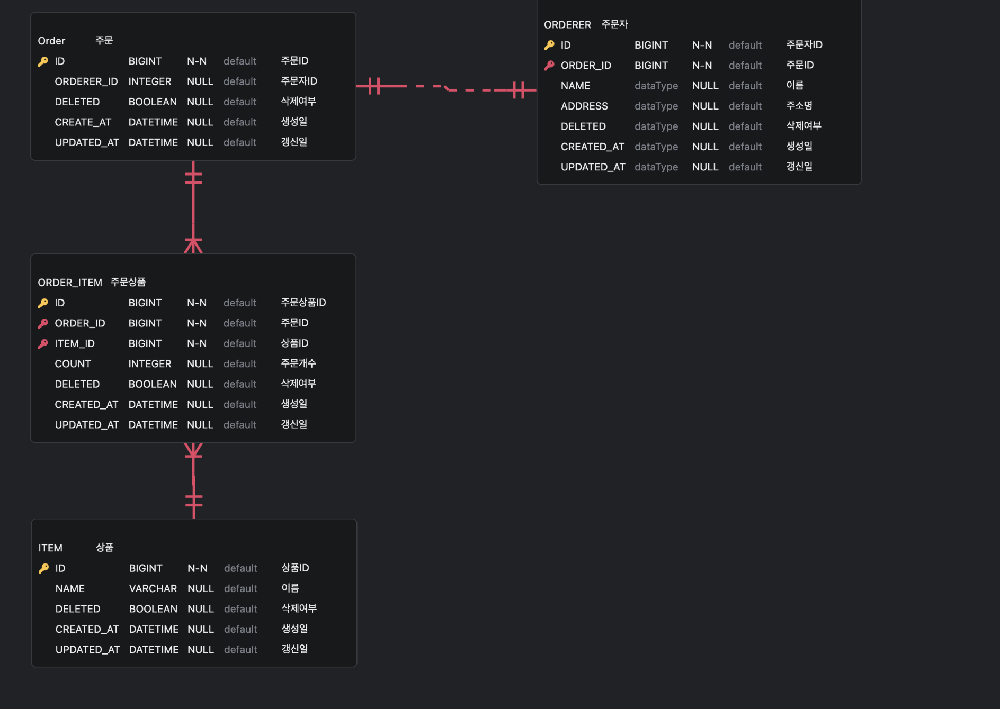

# spring-boot-shop

## ERD



## 개발 포인트

1. POST 요청 시 DTO, VO 및 역직렬화

```java
public class OrdererDtoDeserializer extends JsonDeserializer<OrdererDto> {
    @Override
    public OrdererDto deserialize(JsonParser p, DeserializationContext ctxt) throws IOException, IllegalArgumentException {
        JsonNode node = p.getCodec().readTree(p);
        JsonNode nameValue = node.findValue("name");
        final OrdererName name = OrdererName.of(nameValue.asText());
        JsonNode addressValue = node.findValue("address");
        final Address address = Address.of(addressValue.asText());
        return OrdererDto.of(name, address);
    }
}

@JsonDeserialize(using = OrdererDtoDeserializer.class)
public record OrdererDto(
    OrdererName name,
    Address address
) {}
```

2. 엑셀 파일 업로드, 데이터 파싱까지 메소드체이닝 형식으로 처리

```java
final List<Column> columns = new ArrayList<>();
columns.add(Column.of("상품명", "itemName"));
columns.add(Column.of("상품키", "itemId"));
columns.add(Column.of("상품별 주문 수량", "orderCount"));
columns.add(Column.of("주문자명", "ordererName"));
columns.add(Column.of("주문자주소", "ordererAddress"));

final ExcelManager excelManager = new ExcelManager(BulkInsertOrderDto.Request.class, columns);
final List<BulkInsertOrderDto.Request> rows = excelManager
    .loadExcel(file)
    .parse()
    .stream()
    .map(x -> (BulkInsertOrderDto.Request)x)
    .collect(Collectors.toList());
```

3. 코틀린 형식의 유호성 유틸 함수 정의

```java
public class Validator {
    public static void require(boolean condition, Supplier<String> supplier) throws IllegalArgumentException {
        if(supplier == null) {
            return;
        }
        if(!condition) {
            throw new IllegalArgumentException(supplier.get());
        }
    }

    public static void check(boolean condition, Supplier<String> supplier) throws IllegalStateException {
        if(supplier == null) {
            return;
        }
        if(!condition) {
            throw new IllegalStateException(supplier.get());
        }
    }
}
```

## 실행

```
$ git clone https://github.com/cheonkyu/spring-boot-shop
$ cd spring-boot-shop
$ docker-compose up -d
$ ./gradlew bootRun
```

## 실행환경

```
java --version
openjdk 21.0.4 2024-07-16
OpenJDK Runtime Environment Homebrew (build 21.0.4)
OpenJDK 64-Bit Server VM Homebrew (build 21.0.4, mixed mode, sharing)
```

```
docker version
Client:
 Cloud integration: v1.0.22
 Version:           20.10.11
 API version:       1.41
 Go version:        go1.16.10
 Git commit:        dea9396
 Built:             Thu Nov 18 00:36:09 2021
 OS/Arch:           darwin/arm64
 Context:           default
 Experimental:      true

Server: Docker Engine - Community
 Engine:
  Version:          20.10.11
  API version:      1.41 (minimum version 1.12)
  Go version:       go1.16.9
  Git commit:       847da18
  Built:            Thu Nov 18 00:34:44 2021
  OS/Arch:          linux/arm64
  Experimental:     false
 containerd:
  Version:          1.4.12
  GitCommit:        7b11cfaabd73bb80907dd23182b9347b4245eb5d
 runc:
  Version:          1.0.2
  GitCommit:        v1.0.2-0-g52b36a2
 docker-init:
  Version:          0.19.0
  GitCommit:        de40ad0
```

## API

### 단건 주문 등록

POST http://localhost:8080/order

#### 요청
```
{
    "items": [
        {
            "name": "12dsfdf3",
            "count": 12
        }
    ],
    "orderer": {
        "name": "12323",
        "address": "1"
    }
}
```

#### 응답

```
{
    "status": 200,
    "data": {
        "isSuccess": true
    },
    "error": null
}
```

### 엑셀 다건 주문 등록

#### 응답

```
{
    "status": 200,
    "data": {
        "isSuccess": true
    },
    "error": null
}
```